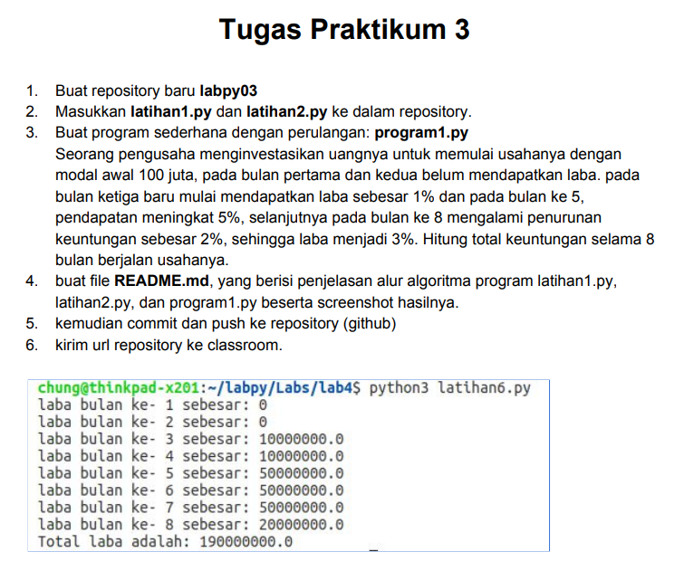
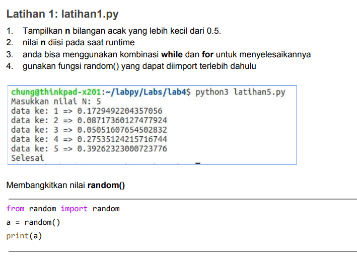
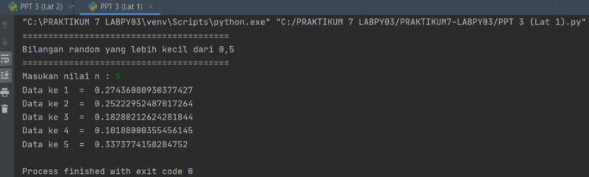
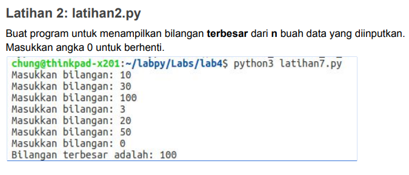

## NAMA :RAFI UBAIDILLAH
## NIM : 312010090
## KELAS : TI. 20 A.1

# DAFTAR ISI 
<table border="2" cellspacing="10">
<tr>
 <td><b>Pertemuan 7</b></td>
    <td>TUGAS 1</td>
    <td><a href="https://github.com/Rafi09/tugas7">Klik disini</td>
  </tr>
  <td><b>Pertemuan 7</b></td>
  <td>Labspy02</td>
  <td><a href="https://github.com/Rafi09/Pertemuan-7-labpy02">Klik disini</td>
  </tr>
  <td><b>Pertemuan 7</b></td>
  <td>Labspy03</td>
  <td><a href="https://github.com/Rafi09/PERTEMUAN-7-PPT2-LABPY03">Klik disini</td>
</tr>

</table>

# TUGAS PRAKTIKUM 3

Pada pertemuan 7 di PPT3 ini saya diberikan beberapa tugas diantaranya yaitu:



# LATIHAN 1

Untuk saat ini saya akan mencoba untuk mengerjakan Latihan 1 seperti gambar dibawah ini terlebih dahulu.



untuk mengerjakannya kalian perlu memasukan sytax berikut

````
import random
print(40*"=")
print("Bilangan random yang lebih kecil dari 0,5")
print(40*"=")
jum = int( input("Masukan nilai n : "))
i = 0
for i in range(jum):
    i += 1
    angkaDec = random.uniform(0, 0.5)
    print("Data ke", i, " = ", angkaDec)
````

Maka hasil yang didapat dari syntax tersebut adalah



# LATIHAN 2

Setelahnya saya akan mencoba untuk mengerjakan Latihan selanjutnya yaitu Latihan 2.



